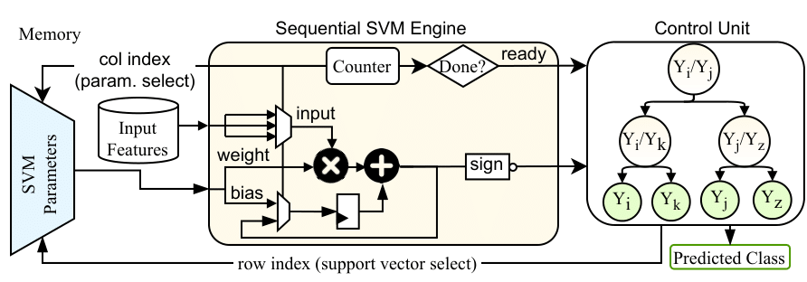

# Highly-Accurate Sequential Support Vector Machines Targeting Printed Electronics

This repository contains the hardware designs and Verilog implementations of **sequential Support Vector Machine (SVM) classifiers** optimized for **Printed Electronics (PE)**. These classifiers significantly reduce area and power consumption compared to state-of-the-art printed ML models while maintaining high classification accuracy.

## 📜 Abstract
Printed Electronics (PE) technology has emerged as a promising alternative to silicon-based computing, offering **low fabrication costs, mechanical flexibility, and conformality**. However, the large feature sizes of PE limit the realization of complex printed **Machine Learning (ML) classifiers**. 

Our work introduces **the first sequential SVM classifiers** tailored for PE, achieving **6× lower area** and **4.6% higher accuracy** than existing printed ML classifiers. By leveraging **bespoke control and storage units** along with a **single Multiply-Accumulate (MAC) compute engine**, we mitigate accuracy loss while maintaining area and power efficiency.

## 📝 Paper
This work has been accepted at **ISCAS 2025**:  
📄 **[Compact Yet Highly Accurate Printed Classifiers Using Sequential Support Vector Machine Circuits](docs/2502.01498v1.pdf)**  

## 🔥 Key Features
✅ **First Sequential SVMs for PE** – A novel approach for resource-constrained printed ML classification.  
✅ **Ultra-Low Area & Power** – Achieves **6× lower area** and **4.6% higher accuracy** than prior PE ML classifiers.  
✅ **Automated Verilog Code Generation** – Hardware descriptions are auto-generated from trained SVM models.  
✅ **Bespoke Control & Storage Units** – Optimized memory and control circuits for PE constraints.  

## 🏛️ Architecture Overview


## 📖 Cite Us
If you found this work useful, please cite:

```bibtex
@INPROCEEDINGS{SequentialSVMs:ISCAS2025,
  author={Sertaridis, Ilias and Besias, Spyridon and Afentaki, Florentia and Balaskas, Konstantinos and Zervakis, Georgios},
  booktitle={IEEE International Symposium on Circuits and Systems (ISCAS)}, 
  title={Compact Yet Highly Accurate Printed Classifiers Using Sequential Support Vector Machine Circuits}, 
  year={2025},
  volume={},
  number={},
  pages={}}
  <!-- doi={DOI_PLACEHOLDER}} --> 
```
